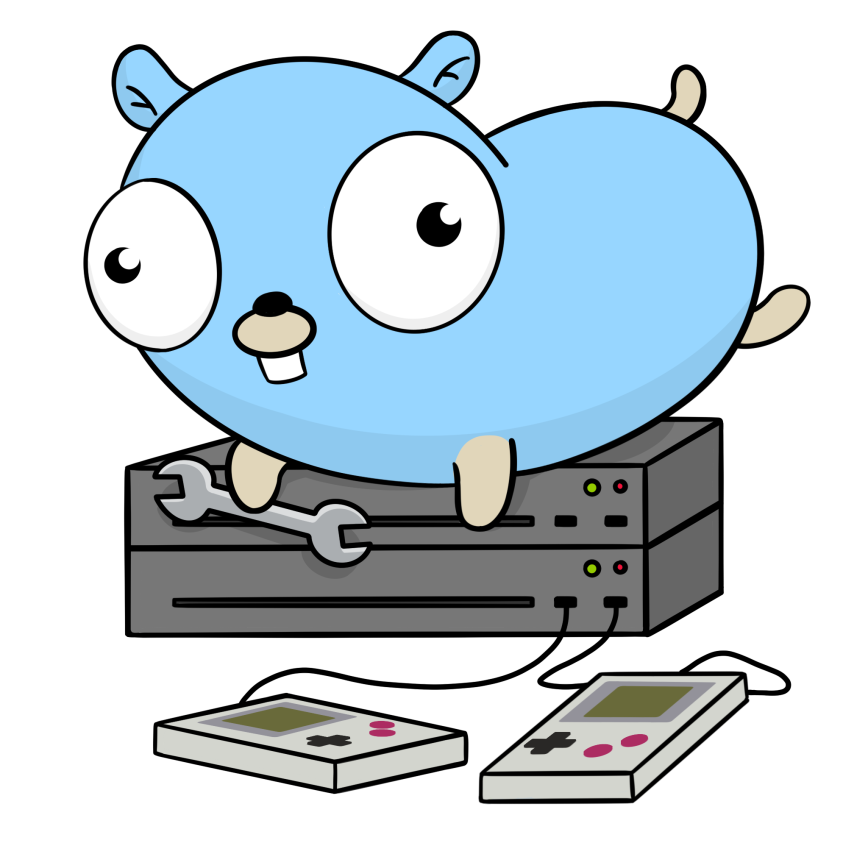
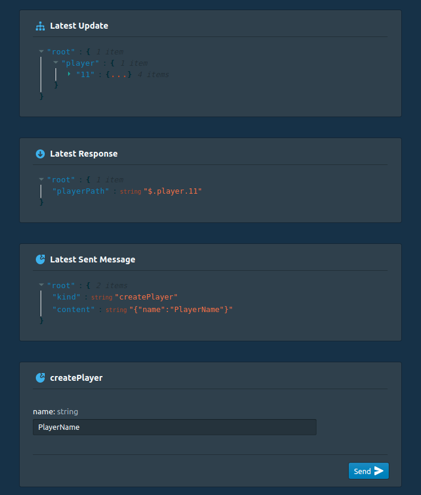

<p align="center">
  
</p>

# backent-cli
backent-cli provides a toolkit to generate a server and a custom API as package which broadcasts state changes of entities automatically.


## Installation
```
go get -u github.com/jobergner/backent-cli
```

# A quick Example:
### Example `config.json`
The API is generated based on a configuration which may look like this:
```JSON
{
    "state": {
        "player": {
            "name": "string",
            "items": "[]item"
        },
        "item": {
            "name": "string",
        }
    },
    "actions": {
        "createPlayer": {
            "name": "string",
            "firstItemName": "string"
        }
    }
}
```
### Generate Server and API with your `config.json`
```bash
backent-cli -config=config.json -out=backent/ generate 
```
### Use the custom-generated engine API to broadcast all changes automatically
```golang
func CreatePlayer(params state.ReceivedParams, engine *state.Engine) {

	player := engine.CreatePlayer()                  // creating the player

	player.SetName(params.Name)                      // setting the player name

	player.AddItem().SetName(params.FirstItemName)   // add an item and set item name

}
```

# Jump right into Experimenting!
Explore backent-cli and its features with the Inspector and toy around until you feel comfortable. You may also want to explore the generated code itself!
```bash
# set up directories
mkdir backent_example; cd backent_example;
go mod init backentexample;

# generate the code
backent-cli -example -out=./backent/ generate;

# run the server
go run .;
# in a different window run the inspector, then open http://localhost:3100/:
backent-cli inspect;
```
The Inspector is a graphical user interface for you to run locally and inspect your backent-cli generated server's behaviour, or in this case an example server that backent-cli will set up for you.

You can also inspect backent servers that are not running on port 3496 by using query parameters in the URL: `http://localhost:3100?port=8080`



# Overview
When generating a server the console will output the content of a possible `main.go` file for you to copy and paste. You may then edit the actions and sideEffects.
```golang
package main

// import the API
import (
    state "yourproject/generatedpackage"
)

// how many processing frames per second the server will run
const fps = 30

func main() {
	err := state.Start(actions, sideEffects, fps, 3496)
	if err != nil {
		panic(err)
	}
}

// define what is being executed on receiving a message
var actions = state.Actions{
	CreatePlayer: func(params state.CreatePlayerParams, engine *state.Engine) {
		player := engine.CreatePlayer()                // creating the player

		player.SetName(params.Name)                    // setting the player name

		player.AddItem().SetName(params.FirstItemName) // add an item and set item name

	}, // state change is automatically broadcasted
}

// define what is being executed on server deploy and after all actions for a processing frame tick are processed
var sideEffects = state.SideEffects{
	OnDeploy:    func(engine *state.Engine) {},
	OnFrameTick: func(engine *state.Engine) {},
}
```
## Connecting to the websocket endpoint may look like this:
```javascript
const ws = new WebSocket("ws://localhost:3496/ws");
ws.open = () => this.setSocketStatus("open");
ws.onclose = () => this.setSocketStatus("closed");

ws.onmessage = (e) => {
    const message = JSON.parse(e.data);
    if (message.kind === "currentState") {
        console.log("receiving initial state:", JSON.parse(message.content))
    } else if (message.kind === "update") {
        console.log("receiving update", JSON.parse(message.content));
    } else {
        this.setReceivedData("received message response", JSON.parse(message.content));
    }
};
```
## Send a Message to trigger an Action:
This is an example message the server understands via the `/ws` websocket connection. It interprets the message to trigger actions. In this case the server will trigger the `CreatePlayer` action with the given data passed as parameter.
```JSON
{
    "kind": "createPlayer",
    "content": "{\"name\": \"string\",\"firstItemName\": \"string\"}"
}
```
## Server Endpoints
| Endpoint   | Description                                                                                                                                                                         |
| ---------- | ----------------------------------------------------------------------------------------------------------------------------------------------------------------------------------- |
| `/ws`      | The Websocket endpoint. This is how a client can connect to the server. They will receive the current state of all entities when they connect, and from there all occuring updates. |
| `/inspect` | Here any client can inspect the config the server was generated with. This can be helpful as it explains all types, actions and responses.                                          |
| `/state`   | This endpoint returns the current state of all entities.                                                                                                                            |

## CLI Flags
| generate flags                 | Description                                                                                                            |
| ------------------------------ | ---------------------------------------------------------------------------------------------------------------------- |
| `-out=<string>`                | Which directory backent-cli is supposed to generate the code into. If the directory does not exist it will be created. |
| `-config=<string>`             | The config file which is used to generate the API                                                                      |
| `-example=<optional bool>`     | With this flag enabled an example server will be generated and the `-config` flag will be ignored.                     |
| `-engine_only=<optional bool>` | Enable to only generate the engine and API part of the package, omitting the server.                                   |

| inspect flags    | Description                                                |
| ---------------- | ---------------------------------------------------------- |
| `-port=<string>` | On which port the inspector should run (defaults to 3100). |


# The Basics
## Defining the Config:
The config's syntax is inspired by Go's own syntax. If you have knowledge of Go you will intuitively understand what is going on. And if you find yourself struggling and make mistakes, comprehensive error messages will help you correct them. There are however some additional restrictions to which values you can use where. More info on that here.

The config may consist of 3 parts: `state`, `actions` and `responses`.

### state:
The state consists of types which you can consider the equivalent to Go's structs: Structures with field names and values describing the types. As it is with go, when defining a type, you can use it as a field's value:
```JSON
{
  "address": {
    "streetName": "string",
    "houseNumber": "int"
  },
  "house": {
    "address": "address"
  }
}
```
More about defining state types can be found here.
### actions:
Actions is how the server and client communicate. Here you can define which client data you want the server to be aware of in order to react with the assigned behaviour. Defining actions is very similar to defining the state except for some additional limitations. Only Go's basic types, and type references in the form of IDs can be used as values.
```JSON
{
  "buildNewHouse": {
    "owner": "personID",
    "streetName": "string",
    "houseNumber": "int"
  }
}
```
The generator creates all necessary structures for you to simply tell the server how to react to a received action. The `params` struct will contain the defined data. Make use of your personal API to manipulate the `engine`'s state. The engine will keep track of all the changes you have made and tell the server to broadcast the changes to all connected clients automatically. 
```golang
// ...
var actions = state.Actions{
	BuildNewHouse: func(params state.BuildNewHouseParams, engine *state.Engine) {
		house := engine.CreateHouse()
		address := house.Address()
		address.SetStreetName(params.StreetName)
		address.SetHouseNumber(params.HouseNumber)
	},
}
// ...
```
### responses:
Sometimes you may want to send back data to the client who sent the action. This can be done with responses. Defining responses works exactly the same way as defining actions. Assigning a response to an actions works by giving the response the same name as the action:
```JSON
{
  "actions": {
    "buildNewHouse": {
      "streetName": "string",
      "houseNumber": "int"
    }
  }
}
{
  "responses": {
    "buildNewHouse": {
      "houseID": "houseID",
    }
  }
}
```
Now we can tell the server to return data to the client.
```golang
// ...
var actions = state.Actions{
	BuildNewHouse: func(params state.BuildNewHouseParams, engine *state.Engine) state.BuildNewHouseResponse {
		house := engine.CreateHouse()
		address := house.Address()
		address.SetStreetName(params.StreetName)
		address.SetHouseNumber(params.HouseNumber)
		// `ID()` is a getter method to acces the ID of an entity
		return state.BuildNewHouseResponse{houseID: house.ID()} // <- return data to client
	},
}
// ...
```

## State Structure and Updates:
Updates are assembled in a tree-like structure, containing only entities that have updated or who's children have updated. In the action section we have learned how to create a new entity of the `house` type. Creating an entity automatically creates all its children with default values, even if they are not modified. It is just what you'd expect from Go. So the tree update of just the `engine.CreateHouse()` call alone woud look like this:
```JSON
{
    "house": {
        "1": {
            "address": {
                "id": 2,
                "streetName": "",
                "houseNumber": 0,
                "operationKind": "UPDATE"
            },
            "operationKind": "UPDATE"
        }
    }
}
```
This is the data every connected client would receive as result of a `engine.CreateHouse()` call. You can see how each created entity has a `operationKind:"UPDATE"` value. This tells the client that this entity is new or has updated since the last received update.

Imagine you defined a second action with the name `changeHouseNumber` which behaves like this:
```golang
var actions = state.Actions{
	// ...
	ChangeHouseNumber: func(params state.ChangeHouseNumberParams, engine *state.Engine) {
		house := engine.House(params.HouseID)
		house.Address().SetHouseNumber(params.NewHouseNumber)
	},
}
```
Triggering this action with a message would result in the following tree update:
```JSON
{
    "house": {
        "1": {
            "address": {
                "id": 2,
                "streetName": "",
                "houseNumber": 1,
                "operationKind": "UPDATE"
            },
            "operationKind": "UNCHANGED"
        }
    }
}
```
As the the `house` entity itself has not updated, but only its child `address`, it maintains the `operationKind:"UNCHANGED"` value. This way the client can tell that the `house` entity has remained the same since the last update.

When an entity is deleted, all its children which are not references will be deleted as well. Eg. delete a house (`engine.DeleteHouse(1)`) in this example:
```JSON
{
  "address": {
    "streetName": "string",
    "houseNumber": "int"
  },
  "house": {
    "address": "address"
  }
}
```
would produce the following update:
```JSON
{
    "house": {
        "1": {
            "address": {
                "id": 2,
                "streetName": "",
                "houseNumber": 0,
                "operationKind": "DELETE"
            },
            "operationKind": "DELETE"
        }
    }
}
```

### How Slices Work:
Slices behave like you'd expect slices to work. However, to make all entity paths within a tree structure immutable, slices are marshalled as maps. This way we can use the entity's ID instead of its index which could shift during entity modification. In a scenario where your config looks like this:
```JSON
{
  "address": {
    "streetName": "string",
    "houseNumber": "int"
  },
  "house": {
    "address": "address",
    "residents": "[]person"
  },
  "person": {
    "name": "string"
  }
}
```
and you trigger an action which looks like this:
```golang
// ...
var actions = state.Actions{
	AddResidentToHouse: func(params state.AddResidentToHouseParams, engine *state.Engine) {
		house := engine.House(params.HouseID)
		house.AddResident()
	},
}
// ...
```
this would be the emitted update:
```JSON
{
    "house": {
        "1": {
            "residents": {
                "2": {
                  "id": 2,
                  "name": "",
                  "operationKind": "UPDATE"
                }
            },
            "operationKind": "UPDATE"
        }
    }
}
```
(note how the `house` has `operationKind:"UPDATE"` as its `residents` field got modified)

As you can see even though `residents` is defined as slice, and a getter call of `house.Residents()` would retrieve a slice of `person`, the field is marshalled as if it was a map. This way this particular `person` will always have the same path within the tree throughout it`s entire lifecycle.

Removing an entity from a slice does not delete the entity straight away. The entity persists with `operationKind:"DELETE"` so the client knows the being deleted. The actual deletion of the entity happens in the next update cycle. So triggering the following action:
```golang
// ...
var actions = state.Actions{
	RemoveResidentFromHouse: func(params state.RemoveResidentFromHouseParams, engine *state.Engine) {
		house := engine.House(params.HouseID)
		house.RemoveResident(2)
	},
}
// ...
```
would produce this update:
```JSON
{
    "house": {
        "1": {
            "residents": {
                "2": {
                  "id": 2,
                  "name": "",
                  "operationKind": "DELETE"
                }
            },
            "operationKind": "UPDATE"
        }
    }
}
```

# Advanced Types:
## Type References:
Sometimes you want an entity to have a certain value, but not necessarily own that value, as the value is an entity that exists on itself, and not as a child of another entity. This can be done by using references. An example that would make its usefullness clear would be this one:
```JSON
{
    "menu": {
        "dishes": "[]*dish",
        "glutenFree": "[]*dish",
        "vegetarian": "[]*dish",
        "todaysDeal": "*dish"
    },
    "dish": {
        "name": "string",
        "ingredients": "[]string"
    }
}
```
Read [here](https://github.com/jobergner/backent-cli#api-reference) on how to use the API to handle references.

## The `anyOf` Type:
The `anyOf` type is a Quality of Life feature which lets you define fields to contain more than one type. This brings great flexibility with no additional overhead:
```JSON
{
    "farm": {
        "owner": "string",
        "animals": "[]anyOf<chicken,cow,pig>"
    },
    "chicken": {
        "eggsPerDay": "int"
    },
    "cow": {
        "weight": "float64"
    },
    "pig": {
        "name": "string"
    }
}
```
Read [here](https://github.com/jobergner/backent-cli#api-reference) on how to use the API to handle `anyOf` types.

# Side Effects:
The server `Start` method accepts a `SideEffects` object with the `OnDeploy` and `OnFrameTick` methods.
```golang
var sideEffects = state.SideEffects{
	OnDeploy:    func(engine *state.Engine) {},
	OnFrameTick: func(engine *state.Engine) {},
}
```
### OnDeploy
Is called as soon as the server starts. This is a good opportunity to create entities.
### OnFrameTick
Is called after all actions for a frame tick a processed.

# API Reference
## getters
The value of every field can be retrieved by calling the name of the field. Given the following config:
```JSON
{
  "address": {
    "streetName": "string",
    "houseNumber": "int"
  },
  "house": {
    "address": "address",
    "residents": "[]person"
  },
  "person": {
    "name": "string"
  }
}
```
the values can be retrieved like this:
```golang
house := engine.House(id)                      // house
alsoHouse, exists := engine.House(id).Exists() // if you can not be sure wether the element exists you can check
residents := house.Residents()                 // []person
address := house.Address()                     // address
streetName := house.Address().StreetName()     // string
name := house.Residents()[0].Name()            // string
```
In the case of a referenced value:
```JSON
{
    "menu": {
        "todaysDeal": "*dish"
    },
    "dish": {
        "name": "string",
        "ingredients": "[]string"
    }
}
```
retrieve the values like this:
```golang
menu := engine.Menu(id)                           // menu
dealRef := menu.TodaysDeal()                      // reference object of dish, bool whether its set
alsoDealRef, isSet := menu.TodaysDeal().IsSet()   // if you can not be sure wether the reference is set you can check
deal := dealRef.Get()                             // dish
```

In case of fields with `anyOf` types:
```JSON
{
    "farm": {
        "owner": "string",
        "cutestResident": "anyOf<chicken,cow,pig>"
    },
    "chicken": {
        "eggsPerDay": "int"
    },
    "cow": {
        "weight": "float64"
    },
    "pig": {
        "name": "string"
    }
}
```
retrieve the values like this:
```golang
farm := engine.Farm(id)                   // farm
cutestResident := farm.CutestResident()   // chicken|cow|pig
animalKind := cutestResident.Kind()       // "Chicken"|"Cow"|"Pig"
cow := cutestResident.Cow()               // cow
// if you know of which kind the animal is you can retrieve it directly
cow := farm.CutestResident().Cow()        // cow
```

If you try to retrieve a value where there is none, all manipulations applied to this entity will have no effect.
This can happen during the following curcumstances:
```JSON
{
    "foo": {
        "bam": "*bar",
        "bal": "anyOf<bar,baz>"
    }
}
``` 
```golang
foo := engine.Foo(123)           // foo with id 123 may not exist
bam := foo.Bam()                 // bam may not be set
balRef := foo.Bal()
bar := balRef.Bar()              // bal may be of type baz and not bar
```

## creators
The `engine` has creator methods for all entities. They are as straightforward as it gets:
```JSON
{
    "chicken": {
        "eggsPerDay": "int"
    },
    "cow": {
        "weight": "float64"
    },
    "pig": {
        "name": "string"
    }
}
```
```golang
chicken := engine.CreateChicken()
cow := engine.CreateCow()
pig := engine.CreatePig()
```
## deleters
You can delete created entitys just as easily as you created them:
```JSON
{
    "chicken": {
        "eggsPerDay": "int"
    },
    "cow": {
        "weight": "float64"
    },
    "pig": {
        "name": "string"
    }
}
```
```golang
engine.DeleteChicken(chickenID)
engine.DeleteCow(cowID)
engine.DeletePig(pigID)
```

## setters
Every field with a value of one of Go's basic types has a setter method to set the value. The method will always be called `Set<FieldName>`. The following config:
```JSON
{
    "chicken": {
        "eggsPerDay": "int"
    },
    "cow": {
        "weight": "float64"
    },
    "pig": {
        "name": "string"
    }
}
```
will come with these setters:
```golang
engine.Chicken(chickenID).SetEggsPerDay(3)
engine.Cow(cowID).SetWeight(56.4)
engine.Pig(pigID).SetName("Gunter")
```
Referenced values will come with additional setters when they are not part of a slice:
```JSON
{
    "chicken": {
        "bestFriend": "*chicken",
    }
}
```
```golang
chicken := engine.Chicken(id)
friendlyChicken := engine.CreateChicken()
_, isSet := chicken.BestFriend().IsSet()       // false

chicken.SetBestFriend(friendlyChicken.ID())    // sets the reference
friendlyChickenRef, _ := chicken.BestFriend()  // the friendly chicken reference
_, isSet := friendlyChickenRef.IsSet()         // true
friendlyChicken := friendlyChickenRef.Get()    // the friendly chicken

chicken.BestFriend().Unset()                   // unsets friendlyChicken as chicken's best friend
_, isSet = friendlyChickenRef.IsSet()          // false
```
Fields with `anyOf` values also have additional setters, when they are not references:
```JSON
{
    "farm": {
        "owner": "string",
        "cutestResident": "anyOf<chicken,cow,pig>"
    }
}
```
```golang
farm := engine.Farm(id)
cutestResidentKind := farm.CutestResident().Kind()   // default is always the first type of the list ("Chicken")
farm.CutestResident().SetCow()
cutestResidentKind = farm.CutestResident().Kind()    // "Cow"
```
## adders
Adders are methods to add entitys to fields with slice values. These are the different variants of slices that exist:
```JSON
{
    "person": {
        "ensurances": "[]ensurance",
        "friends": "[]*person",
        "nickNames": "[]string"
    }
}
```
The adders look like this:
```golang
person := engine.Person(id)
newEnsurance := person.AddEnsurance()  // returns the newly created ensurance

newFriend := engine.CreatePerson()
person.AddFriend(newFriend.ID())       // new friend added, no return

person.AddNickNames("peter", "pete")   // since nickNames is a slice of a basic type AddNickNames is a variadic function
```

## removers
Just like you can add to fields with slice values, you can also remove entitys:
```JSON
{
    "person": {
        "ensurances": "[]ensurance",
        "friends": "[]*person",
        "nickNames": "[]string"
    }
}
```
Removers will always return the entity they are called on for convenient method chaining:
```golang
person := engine.Person(id)
_ = person.RemoveEnsurance(ensuranceID)   // returns person, just like all removers

person = person.RemoveFriend(personID)

person.RemoveNickNames("peter", "pete")
```

## meta fields
every entity comes with meta fields that you can access freely. Currently the only meta fields are `Path()` and `ID()`:
```JSON
{
  "address": {
    "streetName": "string",
    "houseNumber": "int"
  },
  "house": {
    "address": "address",
  },
}
```
```golang
address := engine.CreateHouse().Address()

houseID := house.ID()                   // 1
housePath := house.Path()               // "$.house.1"

addressID := address.ID()               // 2
addressPath := address.Path()           // "$.house.1.address"
```

## Config Restrictions and their Validation Error Messages
### structural:
| Error           | Text                                                             | Meaning                                                         |
| --------------- | ---------------------------------------------------------------- | --------------------------------------------------------------- |
| ErrIllegalValue | value assigned to key "{KeyName}" in "{ParentObject}" is invalid | An invalid value was defined (nil, "", List, Object in Object). |
<br/> 

### syntactical:
| Error                 | Text                                                                         | Meaning                                                                               |
| --------------------- | ---------------------------------------------------------------------------- | ------------------------------------------------------------------------------------- |
| ErrIllegalTypeName    | illegal type name "{KeyName}" in "{ParentObject}"                            | A type was named without adhering to syntax limitations (e.g. "fo$o", "func", "<-+"). |
| ErrInvalidValueString | value "{ValueString}" assigned to "{KeyName}" in "{ParantObject}" is invalid | An invalid value was assigned to a key                                                |
<br/> 

### logical:
| Error                 | Text                                                          | Meaning                                                              |
| --------------------- | ------------------------------------------------------------- | -------------------------------------------------------------------- |
| ErrTypeNotFound       | type with name "{TypeName}" in "{ParentObject}" was not found | A type was referenced as value but not defined anywhere in the data. |
| ErrRecursiveTypeUsage | illegal recursive type detected for "{RecurringKeyNames}"     | A recursive type was defined.                                        |
| ErrInvalidMapKey      | "{MapKey}" in "{ValueString}" is not a valid map key          | An uncomparable type was chosen as map key.                          |
| ErrUnknownMethod      | type "{TypeName}" has no method "{Literal}".                  | An unknown method was attempted to be referenced.                    |
<br/> 

### thematical:
Despite the fact that each of these errors would find a place in one of the above mentioned categories, they are listed separately from them since they are specific to the use case, and not related to the validation of actual go declarations at all.
| Error                        | Text                                                                                         | Meaning                                                                                                                          |
| ---------------------------- | -------------------------------------------------------------------------------------------- | -------------------------------------------------------------------------------------------------------------------------------- |
| ErrIncompatibleValue         | value "{ValueString}" assigned to "{KeyName}" in "{ParentObject}" is incompatible.           | The assigned value can't be used, as only golang's basic types, self defined types, and slices and pointers of them can be used. |
| ErrNonObjectType             | type "{TypeName}" is not an object type.                                                     | The defined type is not an object.                                                                                               |
| ErrIllegalCapitalization     | {type/field name} "{literal}" starts with a capital letter.                                  | A type or field name starts with a capital letter, which is not allowed.                                                         |
| ErrConflictingSingular       | "{KeyName1}" and "{KeyName2}" share the same singular form "{Singular}".                     | Due to the way state will be used two field names cannot have the same singular form.                                            |
| ErrUnavailableFieldName      | "{KeyName}" not an available name.                                                           | Due to internal usage of this FieldName it is unavailable.                                                                       |
| ErrDirectTypeUsage           | the type "{TypeName}" was used directly in "{ActionName}" instead of its ID ("{TypeName}ID") | Only IDs of types are available in actions                                                                                       |
| ErrIllegalPointerParameter   | the parameter "{FieldName}" in "{ActionName}" contains a pointer value                       | Pointers can not be used as parameter as it would not make any sense                                                             |
| ErrTypeAndActionWithSameName | type and action "{Name}" have the same name                                                  | Types and Actions with the same name would cause conflicts in the generated code                                                 |
| ErrInvalidAnyOfDefinition    | "{valueString}" is not a valid `anyOf` definition                                            | anyOf definitions can not have single or duplicate types and must be in alphabetical order                                       |
| ErrResponeToUnknownAction    | there is no action defined for response "{ResponseName}"                                     | a response can only be defined with the same name as the action it belongs to                                                    |


# For Developers

## Getting started:
```
# install necessary dependencies
bash bootstrap.sh;

# generate necessary files (you may ignore output if its not an error)
go generate;

# run tests
go test ./...
```

## Project Structure
| location                                               | description                                                                                                                                                                               |
| ------------------------------------------------------ | ----------------------------------------------------------------------------------------------------------------------------------------------------------------------------------------- |
| `/assets`                                              | assets for README                                                                                                                                                                         |
| `/example.config.json`                                 | used for generating examples in end2end testing and `/integrationtest/state`                                                                                                              |
| `/examples/application`                                | contains an example of a application                                                                                                                                                      |
| `/examples/application/server`                         | serves as an example for a server and is a source for copying code into `copied_from_examples.go` during `go generate`                                                                    |
| `/examples/application/server/gets_generated.go`       | this file contains the only server related declarations that are not copy pasted, but will be generated during runtime based on the config                                                |
| `/examples/application/server/state.go`                | engine & API generated with `-engine_only` flag during `go generate`, required for server example to run. Generated code is based on `example.config.json`                                |
| `/examples/configs`                                    | contains examples for configs, same as `example.config.json`, but in `go`. its what `/examples/engine/` and `/examples/application/server/gets_generated.json` and all tests are based on |
| `/examples/engine`                                     | serves as an example for an engine & API. Is also a source for copying code during `go generate` as imports are being used and written into `copied_from_examples.go`                     |
| `/generate`                                            | script to generate `copied_from_examples.go`                                                                                                                                              |
| `/inspector`                                           | the inspector application (POC)                                                                                                                                                           |
| `/inspector/build`                                     | contains the built inspector app. the built always needs to be checked in as it's being hosted when calling the `inspect` command                                                         |
| `/integrationtest`                                     | starts a server and runs an integration test on `go test .`                                                                                                                               |
| `/integrationtest/state`                               | server & engine & API generated based on `example.config.json` during `go generate` to test                                                                                               |
| `/pkg/ast`                                             | turns valid config.json into AST                                                                                                                                                          |
| `/pkg/enginefactory`                                   | writes the engine & API                                                                                                                                                                   |
| `/pkg/enginefactory/stringified_state_engine_decls.go` | is generated during `go generate`. contains copy-pasted content of `/examples/engine`. Used to test output of `enginefactory` against                                                     |
| `/pkg/factoryutils`                                    | some utils for code generation                                                                                                                                                            |
| `/pkg/getstartedfactory`                               | writes the template for the user to copy-paste which is printed during runtime                                                                                                            |
| `/pkg/serverfactory`                                   | writes declarations for server (what can be seen in `/examples/application/server/gets_generated.go`)                                                                                     |
| `/pkg/serverfactory/stringified_server_decls.go`       | is generated during `go generate`. contains copy-pasted content of `/examples/application/server/gets_generated.json`. Used to test output of `serverfactory` against                     |
| `/pkg/testutils`                                       | utils for testing                                                                                                                                                                         |
| `/pkg/validator`                                       | validates a user's config                                                                                                                                                                 |
| `/tmp`                                                 | exists as an out target when running `go run .`                                                                                                                                           |
| `/copied_from_examples.go`                             | contains code created during `go generate` by `/generate`. content is used during runtime. contains all code that is not written based on a config but can be copy-pasted from examples   |
| `/docker-compose.yml`                                  | contains instructions to start docker containers for end2end testing                                                                                                                      |


## The Idea
The project's only purpose is to provide the API to a server which broadcasts state changes to connected clients. It is not supposed to persist data, provide tools to deploy itself or any other utility, as the user is enabled to do all these things themselves by making use of the existing functionality. I want the project to be good at one thing, not mediocre at many.

Intentionally very little of what is going on under the hood is exposed. The user should only have to interact with method names that are self explanatory. The API should be as simple as possible while giving all necessary access to the data. The API should also feel very intuitive.

The idea is to provide the user with a custom API that is easy to use and prevents them from making mistakes. The user should simply not be able to cause unintended behaviour or panics because they used the API in an incorrect way. This is why the user can eg. `get` an entity which does not even exist and call various methods on it without it affecting the state at all. In these cases the API intercepts by returning an entity with `operationKind:"DELETE"`, and by design all methods called on an entity with `operationKind:"DELETE"` return without actually doing anything, as there is no point in modifying a deleted entity ever.

Knowledge of Go is required to use the tool, but only superficial knowledge. Go was chosen because it's a language that is easy to learn, but allows for writing fast and maintainable code if you are adept at it (but mainly because I like the language if I'm honest). Go also has a neat way of defining types, which makes creating a `config.json` feel very familiar.

## Tests
Before running the tests you need to run `go generate` as it generates the necessary expected outputs for some tests (more on that below). However `go generate` takes a bit of time to run, so feel free to only run the commands that generate the specific files you're working on.

## Testing generated Code:
I'm not entirely convinced that generating tests alongside generated code is the best way to do things, at least not for me. When I'm testing it is nothing more than an attempt at reducing the likelyhood of my tested code being faulty. I make mistakes while writing code, and I also make mistakes while writing tests. So I can never be really sure if my code does what I think it does, but with each test I can try to get closer to certainty.

Generating tests does not seem to be the right approach for me, as a lot of logic (and developer time!) is involved. That logic comes with additional possible mistakes, which in turn would again require tests. And at this point I have to ask myself: Am I really approximating s state of less faulty code efficiently?

This is why I decided to use the following approach:
1. write an example of what the code I want to generate looks like (eg. `examples/engine`)
2. test that code with hardly any logic involved in the tests themselves (eg. `examples/engine/state_engine_test.go`)
3. use [decltostring](https://github.com/jobergner/decltostring) to take a snapshot of every declaration in my example code (eg. `enginefactory/stringified_state_engine_decls.go`)
4. check if my generated code looks like the declarations in my snapshot (eg. `enginefactory/write_adders_test.go`)

With this approach I've not only avoided spending time writing generators for tests, I've actually saved time overall. Typing out the example code (eg. `examples/engine`) did not really take very long, it made it very easy to test the code that I want to generate, and it doubles as a base for generating tests for my code generators in a no-effort-manner.

I've thought about whether this approach makes my generated code vulnerable to bugs. After all I'm only testing the example code, which is merely one version of what my generated code can look like. With a different `config.json` the generated code may look completely different. However, this is where this way of doing things really shined in my case. Because my code generator itself serves as a test for my code example.

Imagine I want to generate adders for number types, so my code example looks like this:
```golang
func addInts(a, b int) int {
	return a + b
}
func addFloats(a, b float64) float64 {
	return a - b
}
```
You may have noticed that I've already made a mistake in `addFloats`. This happens quite often. The tests of my example code do not cover every single function, as it would simply take too much time, and they actually don't have to! Because when I'm writing my generators, I'm simultaneously writing these tests. It will become more clear when you look at the generator for these functions.
```golang
func generateAdder(typeName string) {
	Func().Id("add" + Title(typeName) + "s").Params(Id("a"), Id("b").Id(typeName)).Id(typeName).Block(
		Return(Id("a").Op("+").Id("b")),
	)
}
```
So now when I'm trying to match my code example and my generated code during my tests, I will immediately be notified of the mismatched `-`/`+` in `addFloats`. This is why I consider the generator a test itself. It is an additional layer of logic that assumes a certain output, just like a test, and it actually has cought noumerous errors in my example code during development. For the code generator not to catch that error I would have had to make the same mistake of using a `-` instead of a `+` in all adders, and this kind of mistake would have probably (you never know) been cought by the tests of my code example. The relationship between the example code and the code generator is somewhat like a symbiosis.


## State Structure
Entities are structured in a relational manner. An assembling step exists which organizes the data in it's real tree-like structure. The `Engine` owns 2 state objects. One, the `state`, holds all existing entities, and the other, `the patch` holds all modified entities. The API will never directly modify the `state`, but take a copy of the entity out of the `state`, modify it, and put it into the `patch`. This way we keep track of which entities changed at the end of a cycle. Changed entities are also marked with `operationKind:"UPDATE"` or `operationKind:"DELETE"`. With each cycle we take all entities of the `patch` and either put them into `state` and set their `operationKind` to `UNCHANGED` when their `operationKind` was `UPDATE`, or we delete the existing representation of the entity in the `state` if the `operationKind` was `DELETE`.
```golang
for _, player := range engine.Patch.Player {
	if player.OperationKind == OperationKindDelete {
		delete(engine.State.Player, player.ID)
	} else {
		player.OperationKind = OperationKindUnchanged
		engine.State.Player[player.ID] = player
	}
}
```

Entities are never aware of their parents, as an entity could always be defined to be a child of entity `X` but also of entity `Y`. Introducing logic for an entity to be aware of its parent would have been not worth the effort and the decrease in maintainability of the project.

There are 2 different ways of assembling the data. The default way is to assemble a tree which only includes updated entities, but also their parent entities until root is reached. The assembling itself starts from the root, traverses every branch of the tree, and returns a flag whether it has encountered an updated entity. This is why the assembling methods always return 3 values.
```golang
player, include, hasUpdated := engine.assemblePlayer(playerData.ID, nil, config)
```
`player` is the assembled entity, `include` is whether the entity should be included in its parent, or remain `nil`, and `hasUpdated` which signifies whether the entity or any of its children contain updated data.

The reason why `include` and `hasUpdated` exist the second way of assembling the tree is with the `forceInclude` flag enabled in the `assembleConfig`. While this is the case the assembler includes ALL entities in the tree without regarding whether the data has updated or not.


## API Characteristics:
### be up to date and diesregard non-existing/deleted entities:
When handling entities we always make sure we `get` the most recent version of the entity from the `engine`, so the user never accidentally uses stale data. If the entity could not be found the `get`ter will return an empty entity with `OperationKindDelete`, so the rest of the API is aware that this entity can be disregarded, even if the user accidentally calls modifying methods on it.
```golang
func (_gearScore gearScore) SetScore(newScore int) gearScore {
	gearScore := _gearScore.gearScore.engine.GearScore(_gearScore.gearScore.ID) // make sure most recent data is used, returns entity with `OperationKindDelete` if entity could not be found
	if gearScore.gearScore.OperationKind == OperationKindDelete {
		return gearScore // return if encountering a non-existing entity
	}
    // ...
}
```
### structure creation like go:
Similar to go, when creating an entity, all children of this entity are created with default values.
```golang
func (engine *Engine) createPlayer(p path, extendWithID bool) player {
	var element playerCore
	element.engine = engine
	element.ID = PlayerID(engine.GenerateID())
	elementGearScore := engine.createGearScore(p.gearScore(), false)
	element.GearScore = elementGearScore.gearScore.ID
	elementPosition := engine.createPosition(p.position(), false)
	element.Position = elementPosition.position.ID
	return player{player: element}
	// ...
}
```
### don't allow `nil` where the cannot be void:
The API does not allow for deletion of non-root entitys by using `delete`rs, as this would cause the parent of the deleted entity to loose a child, which would be very unintuitive behaviour. Compare it with this pseudo-Go example. This is what the logic would look like if the API allowed for non-root entities to be deleted
```golang
type Foo struct {
	bar int
}
func main() {
	x := Foo{1}
	delete(x, "bar")
	fmt.Println(x.bar) // panics because void
}
```
Instead the API just returns:
```golang
func (engine *Engine) DeletePlayer(playerID PlayerID) {
	player := engine.Player(playerID).player
	if player.HasParent {
		return
	}
	engine.deletePlayer(playerID)
}
```
### only show the user what's needed:
The user will never handle entities directly. They will always be given a wrapper which has access to the required API methods. You can see in the `get`ters that they all wrap the entities before they return it. The reason why wrappers exist for entities is in case I ever decide I want to marshal entities directly before they are assembled in a tree structure (only exported fields can be marshalled). 
```golang
// playerCore holds the data
type playerCore struct {
	ID            PlayerID                  `json:"id"`
	// ...
}

// player wraps playerCore and has access to the data, while providing the methods to the user
type player struct{ player playerCore }

// getter wraps playerCore in player before returning
func (engine *Engine) Player(playerID PlayerID) player {
	patchingPlayer, ok := engine.Patch.Player[playerID]
	if ok {
		return player{player: patchingPlayer}
	}
	// ...
}

// AddItem exists on player, not playerCore
func (_player player) AddItem() item {
	// ...
}
```

### generated entity types:
Some types are generated alongside the user-defined entities. This happens when a user references a type `*player` or uses an `anyOf` type like `anyOf<Enemy,Player>`. These generated types exist as containers for the actual entities they hold and provide the user with methods to handle them. In case of reference types, a new reference type is generated for each individual field that holds a reference type:
```JSON
{
    "player": {
        "item": "*item", // creates the playerItemRef
        "friend": "*friend" // creates the playerFriendRef
    }
}
```
This is required as no entity is ever aware of their parent, but if a different type is created for each reference, the reference is aware of it's parent's type by desing, and only needs to know the ID of the parent to find it in `state`. We need to be aware of the parent in references because when a reference is `Unset` we loop thorugh all references of that type in the state and find the parent to remove the reference from it. If this was not the case we would have to loop thorugh all entities which can hold references of that entity kind and then check if the reference exists on that parent. My fear was that this could make the api slow and could complicate the code generators. Although I have to admit that this could be a case of premature optimization or decision making based on vague guesses.

anyOf types get created for each unique entity pair
 ```JSON
{
    "player": {
        "fooOrBar": "anyOf<bar,foo>", // creates anyOfBar_Foo
        "BarOrFoo": "anyOf<bar,foo>", // does not create a new anyOf type as anyOfBar_Foo is already created
        "fooOrBaz": "anyOf<baz,foo>" // creates anyOfBaz_Foo
    }
}
```
This way we can provide only the necessary methods for each kind of anyOf type.

Alongside the anyOf types that get created we generate reference containers of these types. any types have setter methods to replace the current contained child entity with a different one. Eg the type `anyOfPlayer_ZoneItem` owns the `.SetPlayer()` and `.SetZoneItem()` methods which both delete the current child, and create a new one. This however causes problems when you are dealing with references of any types, as a setter method would delete the current child.
being able to call the setters on these references makes no sense. This is why any types have ref wrappers, which are created just before `Get()` is called on the reference. These wrappers exclude the
setter methods.


## Benchmarks
the `examples/engine` has benchmark tests with their record and improvements maintained in `benchmark_results.txt`. 

### test cases check list
- create entity -> Create()
- delete entity -> Delete()
- manipulate entity -> SetName()
- add entity -> AddItem()
- remove entity -> RemoveItem()
- set reference -> SetBoundTo()
- unset reference -> BoundTo().Unset()
- add reference -> AddGuildMember()
- remove reference -> RemoveGuildMember()S
- set anyOf reference -> SetTargetPlayer()
- unset anyOf reference -> Target().Unset()
- switch anyOf type in slice -> Interactable.SetItem()
- switch anyOf type -> SetOriginPosition()
- add anyOf reference -> AddTargetedByPlayer()
- remove anyOf reference -> RemoveTargetedByPlayer()
- creation of reference -> a new reference is created
- deletion of reference -> a reference is deleted
- replacement of reference -> an existing reference is replaced with a different one
- includes entity if reference of reference got updated
- manages cyclical references
- manages self referencing entitys

### TODO
- make slices always return same order through getters (the order currenlty may be changed by removers (sort by id ascending?))
- it is still unclear which methods can be used during broadcasting. We somehow need to limit that.
- you can call Be<Type> on slices of anyOf types which creates a new anyOf container with new ID. this causes the slice of anyOf IDs to lose track if that anyOfContainer and holds plain wrong information. (interactables)


- basic types are currently treated differntly from all other types; they are sent regardless of wether they have uptadet or not
    - solution:
        - make basic types same as other types: own map in state
        - represent them in tree as *type (eg. *int)
        - setters fror them should remain the same
- BROADCASTING (modifications which do not require verification): !!still need to figure out how to conveniently let user define actions with local-first effects
    - actions should consist of 2 methods: `emit` and `broadcast`. `emit` is run only on the server server, `broadcast` is run on the clinet & the server
    - the `emit` method is the one which will return a response
    - calling the action should return a channel which will receive the response
    - EXAMPLES:
        - client side walking
        - attack events
        - targeting (wow)
    - AFFECTED METHODS:
        - anything involving creation of entities is not viable (which basically ruins the whole concept because of reference/any wrappers)
            -> it might not because wrappers are not real entities and their IDs are never exposed
            ... but what if eg. a reference is created client and server side, but then deleted server side. the deletion object with ID x will not remove the
            local reference of id y
            SOLUTION: maybe wrappers should not have own IDs but their IDs should be composed of the underlying "real" elements
            TODO: make sure this is REALLY necessary
            .. non-ref setters of any types do still create elements maybe rename? nonRef=`Be<Type>` ref=remains `Set<Type>`
            -> this would make all `setters` broadcastable
    - somehow there needs to be a way to send an action to the server but not receive the update for that values as it's changed client side
        - lol has server side walking => change gets send to server, response is applied locally
        - diablo 3 has client side walking => change gets applied locally, then broadcasted
    - in the client I somehow need to be able to set certain fields to broadcast mode
    - IDEA:
        - every element can be signed with a clientID `{broadcastedBy: <clientID>}`
        - the client application then filters out all elements which are signed with its `clientID`
        - if multiple clients sign the same element, the signature gets removed (since the element contains data which no client is fully aware of)
        - signing element can be done by `engine.startBroadcast()` and `engine.endBroadcast()` (running code `local first` and broadcasting is kind of the same idea, how to create clarity?)
        - this way braodcasting does not happen action-based, but element-based (freedom for user)
    - PROBLEM:
        - how does it stay in sync? I can't be sure local state and remote state are the same at time of modification
            - the idea of broadcasted events is that it does not require verification from the server
        - what if an event does usually not require verification from server (walking in diablo3) but does in specific instances (a blockade suddenly appears)
            - the user needs to program solutions for these types of events themselves, eg. when a blockade is being put up and the player has moved there client side
            already, the player might have to be hard-reset to the next valid position
- there is currently no way of sending events (eg. sword swing)
    - need to be able to send events as sending state like `hasSwung` will not suffice (user would have to set it to false manually after each tick)
    - event may be triggered multiple times
    - need event to be reset with each update state
    - maybe an `_event` flag could let engine know that a certain type needs to be cleared with each update state (events would never have OperationKindUnchanged/OperationKindDelete)
    - validaiton:
        - events can only be non-pointer slice (any allowed)
        - events cannot be referenced
    - events won't have remove method (or maybe they do idk, but removers cureently mess up slice order)
- currently you can not reference the same element twice in a slice of references due to tree using referenced element ID as map keys 
- what do I want to achieve?
    - (consistency) no dependency on previously emitted entities, which means:
        - -> on (created ref/referencing entity update) assemble referenced entity fully
        - -> paths can only consist of segments which are present in the current update
        - -> paths cannot be evaluated at time of creation anymore
        - -> a ton of more complexity
    - (simplicity) dependency on previously emitted entities (websockets will never receive out-of-order)
        - -> will always need a client keep to track and update local state -> user will always have acces to full tree at all times
        - -> can always acces entities, references will never have to include referenced element
        - -> since I have path to referenced element, can I determine ReferencedDataStatus by checking if it exists in tree?
do i still need assembleCache AND forceIncludeAssembleCache
        - NO YOU CANT BECAUSE AN ELEMENT CAN BE INCLUDED IF ITSELF OR A DESCENDANT REFERENCES AN ELEMENT THAT HAS UPDATED -> need to know 
        ---- maybe elements which have not updated themselves but have a reference of an updating element should not be included in the tree
            - -> requires map to collect pointers of referenceElements, and map to collect IDs of updating(even descendants) elements
                -  -> then in a following process manipulate referenceElement.ReferencedDataStatus depending on referenced element in tree
            - -> would make assembling a lot faster and simpler
            - -> would reduce data sent
            - -> would throw out days of work (recursionCheck (cannot be recursive if referenced entities are not assembled), assembleCache (entities will always be assembled only once)) :(
    
- reserved action names "currentState"  "update"
- error when using example: (because i need to install mods before running (`go mod tidy`))
```
state.go:8:2: no required module provides package github.com/google/uuid; to add it:
	go get github.com/google/uuid
state_easyjson.go:8:3: no required module provides package github.com/mailru/easyjson/jlexer; to add it:
	go get github.com/mailru/easyjson/jlexer
state_easyjson.go:7:3: no required module provides package github.com/mailru/easyjson/jwriter; to add it:
	go get github.com/mailru/easyjson/jwriter
state.go:11:2: no required module provides package nhooyr.io/websocket; to add it:
	go get nhooyr.io/websocket
jonas@jonas-Recoil-II:~/code/backent_e
```
- docker for example test
- documentation

- build fails because of required modules from github. what do? (cant reproduce)
- find open port for integratpon test
- the generated code should prefix user defined names (or in some other way alter them to be unique) so they do not conflict with local variables
- release tree func (release slices, maps, and the pointers themselves)
- (this only appeared to be an issue because i didnt consider that the Setters create an entirely new Ref with anyContainer as child. So the entityKind is always empty and the delete mthod of the child is therefore never triggered. For more clarity I added a deleteCurrentChild parameter to the function) SetTargetPlayer (a reference field) calls the `setPlayer` method, which removes the child entity. CRITICAL ERROR!!!


more to come
